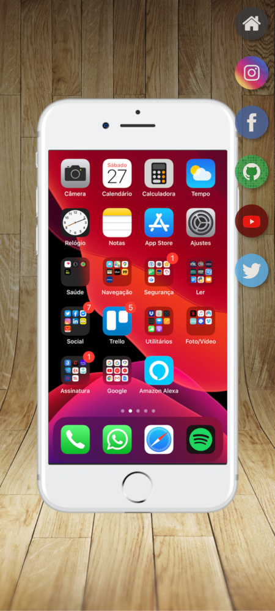
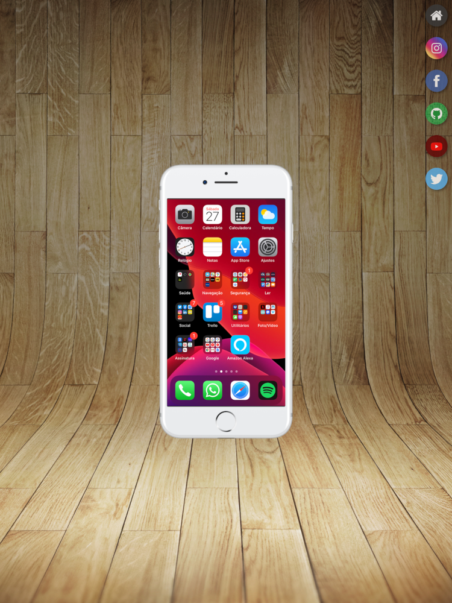
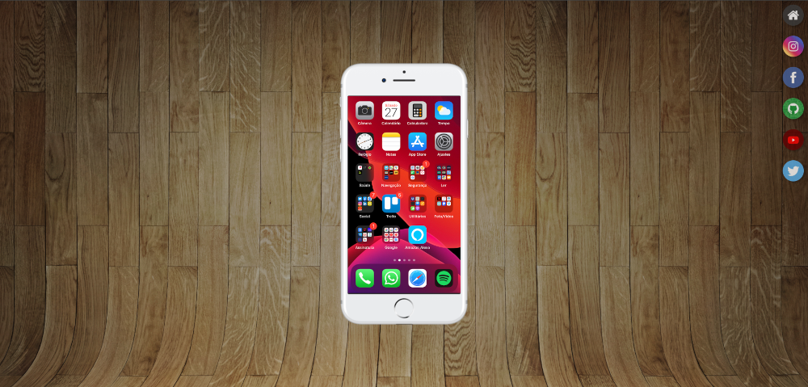

# Projeto Social Media
Projeto que consiste na navegação entre páginas através de iframes, iframes é um recurso utilizado para acessar páginas externas da web sem necessariamente precisar abri-las em outra guia. O projeto simula a navegação entre redes sociais em um aparelho celular. Projeto desenvolvido no curso de HTML5 e CSS3 do [Curso em Vídeo](https://www.cursoemvideo.com), aplicando os conhecimentos estudados e praticados ao longo do curso.     

## Funcionalidades

* Uso de iframes
* Responsividade do conteúdo
* Aplicação de posicionamento de elementos
* Aplicação e manipulação de imagens de fundo

## Tecnologias utilizadas

* HTML5
* CSS3

## Acesso ao Projeto

[Acesse o site](https://allan-alves.github.io/Projeto-Social-Media/)

## Demonstração em diferentes tamanhos de tela

__Mobile - Samsung Galaxy S20 Ultra - 412 x 915__

__Tablet - iPad Pro - 1024 x 1366__

__Desktop - 1920 x 1080__

